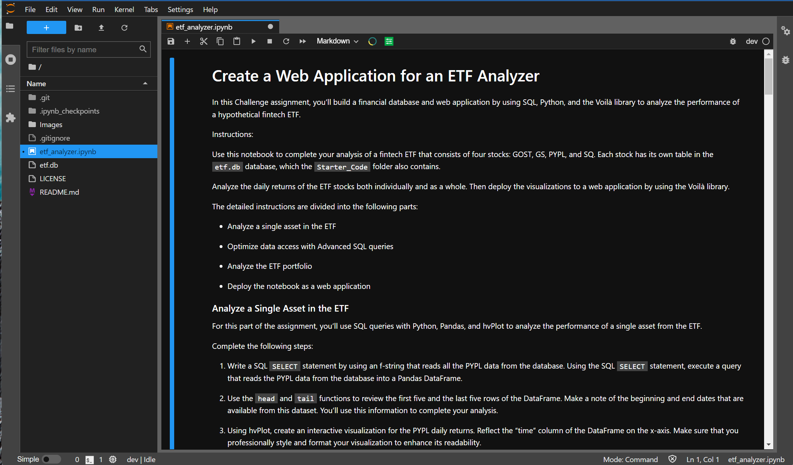

# An Interactive Web App for analyzing an ETF portfolio

> A web application using the Voila library displaying the returns of an ETF portfolio.


---
## Technologies

This project is written using a ```Jupyter Lab 3.2.1``` notebook running  ```Python 3.7.11```.  Key libraries include ```sqlalchemy 1.4.27``` for creating and manipulating the ETF database,```hvplot 0.7.``` for making interactive plots for the data, and ```voila 0.2.16``` for making interactive web application from the jupyter notebook.

---

## Installation Guide

Before running the application, first install the following packages if you don't already have them installed in your development environment.

```python
  pip install jupyterlab
```
You will also need the PyViz ecosystem, including hvPlot for generating the interactive data visualizations.  The PyViz hvPlot package can be installed using the ```conda install``` command:

```python
conda install -c pyviz hvplot
```
To ensure these packages installed properly, run the following commands in a terminal.  A successful install will provide you with the current version numbers for ```hvplot``` installed on your local machine:
```python
conda list hvplot
```

Finally, to convert the jupyter notebook to an interactive web interface, you will need to install [Voila](https://voila.readthedocs.io/en/stable/index.html).  To install, run the following command on your command line:
```python
conda install -c conda-forge voila
```

After a successful installation, ```cd``` into the top folder of the repository.  Then open ```Jupyter Lab``` by typing:
```python
jupyter lab
```

The report and analysis are in the jupyter notebook file named ```etf_analyzer.ipynb```.  

---

## Usage

This Jupyter notebook analyzes an ETF portfolio.  The ETF data is stored in an SQL database and can be queried using custom functions in the notebook.  The data can be visualized and interacted with in real time using a web interface, which is facilitated with Voila.

To view the jupyter notebook used in this analysis, open up a gitbash or terminal in the top folder of the cloned repository.  Open the ```etf_analyzer.ipynb``` file, which should look like the displayed version below:



To deploy the web application, you can use your terminal. `cd` into the top folder of this directory and run the following command with Voila:
```python
voila ./etf_analyzer.ipynb
```
The jupyter notebook will deploy as an interactive web application in your default browser.

## Data Sources

The ETF data used in this report does not represent real world ETFs and is provided in the course materials from a UCBerkeley Fintech Extension program.  

---

## Contributors

The seed code is from the course material from a UCBerkeley Extension program.  This analysis is written and performed by John Gruenewald.<br><br>
For more information, contact **John Gruenewald**:<br>
**e-mail:** [john.h.gruenewald@gmail.com](mailto:john.h.gruenewald@gmail.com)<br> **linked-in:**  [jhgruenewald](https://www.linkedin.com/in/jhgruenewald/)<br>**twitter:**  [@GruenewaldJohn](https://twitter.com/GruenewaldJohn)<br>**medium:**  [@comput99](https://medium.com/@comput99)

---

## License

MIT License

Copyright (c) 2022 John Gruenewald